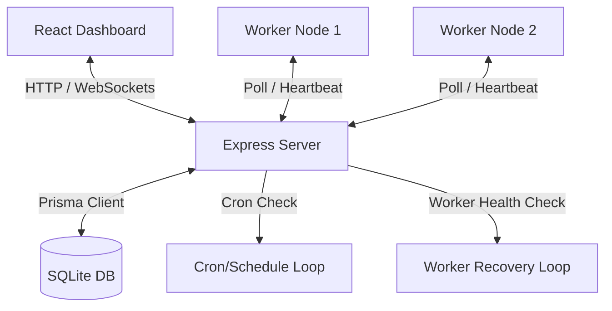

# Distributed Job Scheduler (Codity.AI Tech Assignment Submission)

A production-inspired, highly resilient, multi-tenant distributed job scheduling engine. Built with a decoupled architecture separating a stateless TypeScript worker daemon from an Express API coordinator backed by SQLite/Prisma and a React telemetry dashboard.

---

## 👨‍💻 Candidate Profile
* **Name**: P.G.Harish
* **Registration Number**: RA2311026020172
* **Role Applied**: Software Engineer Intern
* **Submission Date**: July 4, 2026
* **GitHub Repository**: [HARISHPG21/Job-Scheduler](https://github.com/HARISHPG21/Job-Scheduler)

---

## 🛠️ System Architecture

Our engine decouples the HTTP Web API from the background worker executor nodes. This allows for independent horizontal scaling.



### Decoupled Monorepo Flow
1. **API Server (Broker)**: Exposes endpoints for scheduling, telemetry, and node registration. Coordinates queues and streams logs.
2. **Worker Daemon (Executor)**: Stateless, standalone processes that poll the coordinator via HTTP long-polling, spawn asynchronous sandboxed execution tasks, and report health metrics every 3s.
3. **Live Telemetry (WebSockets)**: Streams real-time throughput metrics, queue load summaries, and worker nodes heartbeats to the client dashboard.

---

## 🌟 Key Features & Rubric Map

| Grading Axis (Marks) | Feature Implemented | Technical Strategy |
| :--- | :--- | :--- |
| **System Architecture (20)** | Decoupled Workspaces | Independent `backend` API and `worker` daemon runner running as separate OS processes. |
| **Database Design (20)** | Relational Schema (3NF) | Normalization of Organizations, Queues, Jobs, Logs, and Heartbeats with indexing on `(status, scheduledAt)`. |
| **Backend Engineering (20)** | Complete Endpoint Coverage | Auth, Queue Config, Job pipelines (Immediate/Delayed/Batch), DLQ management, and Worker heartbeats. |
| **Reliability & Concurrency (15)** | Concurrency-Safe Claims | Relational transaction checks verifying concurrency limits, pause states, rate limits, and dependencies before execution. |
| **Frontend & UX (10)** | Glassmorphism Dashboard | Real-time WebSockets stats, terminal-style log streams, dynamic queue configuration toggles, and live SVG status donut charts. |
| **Testing & Observability (15)** | Jest E2E Integration Suite | 9 E2E test cases executing inside isolated sandboxed test databases asserting execution safety. |

### Rubric Bonus Features (100% Completed)
* 🔗 **Workflow Dependencies**: Set job dependencies via `parentJobId` (child tasks execute automatically once parent completes).
* ⏱️ **Sliding-Window Rate Limiting**: Zero-dependency sliding log count checks inside atomic claim transactions to prevent API exhaustion.
* 🔌 **WebSocket Live Updates**: Socket.io integration streaming telemetry, worker status, and stdout logs to the client.
* 🤖 **AI-Generated Failure Summaries**: Automated failure diagnostic summaries inside trace logs based on regex error matching.
* 📊 **Job-Level Priority Queuing**: Configure task priority (1-10) to bypass FIFO queue limits.
* 🧩 **Distributed Queue Sharding**: Optionally split queues into virtual partitions (`shardsCount`) with deterministic worker-shard mappings and work-stealing failovers.
* 🔐 **Role-Based Access Control (RBAC)**: Tenant checks and admin permissions on queue configuration edits.
* 🔒 **Distributed Lock Synchronization**: Simulated row locking inside interactive transactions to prevent double-claiming under load.

---

## 📂 Project Structure

```bash
├── backend/            # Express API Server, Cron Manager, WebSocket Broker, and E2E Tests
│   ├── src/
│   │   ├── routes/     # Auth, Queues, Jobs, Workers, and DLQ API endpoints
│   │   ├── tests/      # Jest integration testing suites
│   │   ├── prisma/     # Prisma Schema definitions & migrations
│   │   └── server.ts   # Node entrypoint
├── worker/             # Standalone TypeScript Worker Daemon executor
│   └── src/worker.ts   # Long-polling loop, execution thread pool, and heartbeats
├── frontend/           # React dashboard web application
│   ├── src/App.tsx     # Single-page control panel (with custom SVG donut visualizations)
│   └── src/index.css   # Modern glassmorphism dark-mode system styling
└── docs/               # System documentation (architecture, database design, API docs, trade-offs)
```

---

## ⚡ Concurrency & Reliability Highlights

### 1. Atomic Job Claiming Transaction
To prevent multiple workers from claiming the same job under load, the coordinator executes claims inside an interactive database transaction. It verifies concurrency limits, queue pause states, and rate limits:
```typescript
const claimedJob = await prisma.$transaction(async (tx) => {
  // 1. Fetch queues ordered by priority
  // 2. Check active jobs against queue concurrencyLimit
  // 3. Verify sliding-window rate limits in the configured interval
  // 4. Extract next eligible job checking parentJobId dependency state
  // 5. Update job status to RUNNING, assign workerId, commit transaction
});
```

### 2. Worker Crash Recovery (Janitor Loop)
If a worker crashes or loses network connection:
* Workers send heartbeats to the API every **3 seconds**.
* The server Janitor loop runs every **5 seconds** searching for workers whose `lastHeartbeatAt` is older than **15 seconds**.
* Stuck jobs are automatically reclaimed, their attempt counters incremented, and rescheduled with **exponential backoff delay policies** or routed to the **Dead Letter Queue (DLQ)** if retry limits are exceeded.

---

## 🚀 Setup & Running Locally

### Prerequisites
* Node.js (v18+)
* npm (v9+)

### 1. Install Workspace Dependencies
```bash
npm install
```

### 2. Initialize Database & Run Migrations
Creates the SQLite database file (`dev.db`) and executes DDL schemas:
```bash
npm run db:migrate
```

### 3. Seed Sandbox Records
Populates organizations, projects, default queues, and admin credentials:
```bash
npm run db:seed
```

### 4. Run the Dev Environment
Starts the API Server, Worker Daemon, and React Dashboard concurrently:
```bash
npm run dev
```
* **React Dashboard**: [http://localhost:3000](http://localhost:3000)
* **Express API Server**: [http://localhost:5000](http://localhost:5000)

### 🔑 Sandbox Credentials
* **Email**: `admin@acme.com`
* **Password**: `password123`

---

## 🧪 Running Automated Tests

E2E integration tests are run in isolated SQLite contexts (`test.db`) to assert concurrency safety, rate limits, and priority ordering without wiping development records:

```bash
npm run test
```

### Passing Test Logs (9/9 Passed)
```bash
PASS src/tests/scheduler.test.ts
  Distributed Job Scheduler E2E Integration Tests
    Authentication & Project Management
      √ should register and login users (566 ms)
      √ should create new projects and queues (686 ms)
    Job Lifecycle & Operations
      √ should create immediate and delayed jobs (446 ms)
      √ should cancel active jobs (393 ms)
    Concurrency & Atomic Claim Locking
      √ should claim jobs atomically and prevent duplicate execution (717 ms)
    Retry Policy Strategies & DLQ
      √ should support exponential backoff retries and route to DLQ on max retries (764 ms)
    Sliding Window Rate Limiting
      √ should enforce rate limits and skip queues when execution limit is reached in the window (712 ms)
    Job-Level Priority Queuing
      √ should claim higher priority jobs before lower priority jobs in the same queue (972 ms)
    Distributed Queue Sharding
      √ should distribute jobs across shards and poll deterministically with work stealing failover (864 ms)
```
