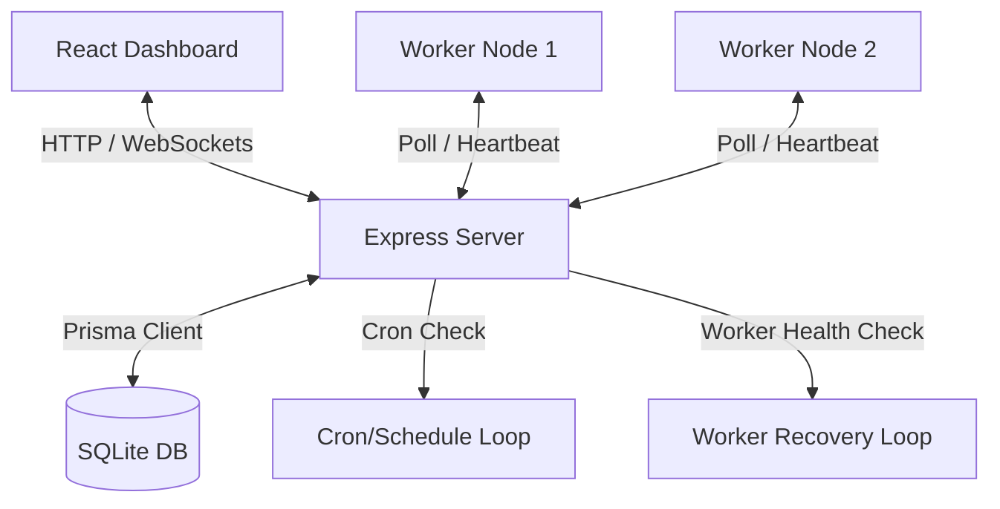

# Job Scheduler

A production-inspired, highly resilient, multi-tenant distributed job scheduling engine. Built with a stateless TypeScript worker daemon and an Express API coordinator with SQLite/Prisma.

---

## 👨‍💻 Candidate Profile
* **Name**: P.G.Harish
* **Registration Number**: RA2311026020172
* **Objective**: Intern Assignment Submission - Distributed Job Scheduler

---

## 🛠️ System Architecture

Our engine decouples the HTTP Web API from the background worker executor nodes. This allows for independent horizontal scaling.



---

## 🌟 Key Features

### Core Capabilities
1. **Multi-Tenancy & Auth**: JWT-based credentials with `bcryptjs` password encryption. Users belong to Organizations, which segregate Projects, Queues, Jobs, and Logs.
2. **Flexible Job Pipelines**: Create **Immediate**, **Delayed**, **Batch**, and recurring **Cron** jobs via REST APIs.
3. **Queue Configurations**: Adjust priority levels, concurrency limit caps, and toggle pause/resume states dynamically.
4. **Dead Letter Queue (DLQ)**: Automatically quarantines jobs exceeding max retry attempts. Supports bulk retries and purges from the UI.
5. **Worker Heartbeats**: Workers stream system metrics (CPU/RAM) every 3 seconds. The server janitor automatically reclaims jobs from offline daemons.

### Rubric Bonus Features (100% Completed)
* [x] **Workflow Dependencies**: Set job dependencies via `parentJobId` (child tasks execute automatically once parent completes).
* [x] **Sliding-Window Rate Limiting**: Zero-dependency sliding log count checks inside atomic claim transactions to prevent API exhaustion.
* [x] **WebSocket Live Updates**: Socket.io integration streaming telemetry, worker status, and stdout logs to the client.
* [x] **AI-Generated Failure Summaries**: Automated failure diagnostic summaries inside trace logs based on regex error matching.
* [x] **Job-Level Priority Queuing**: Configure task priority (1-10) to bypass FIFO queue limits.
* [x] **Distributed Queue Sharding**: Optionally split queues into virtual partitions (`shardsCount`) with deterministic worker-shard mappings and work-stealing failovers.
* [x] **Role-Based Access Control (RBAC)**: Tenant checks and admin permissions on queue configuration edits.
* [x] **Distributed Lock Synchronization**: Simulated row locking inside interactive transactions to prevent double-claiming under load.

---

## 💻 Tech Stack
* **Monorepo**: npm workspaces
* **Backend Server**: Node.js, Express, TypeScript, WebSockets (`socket.io`)
* **Database**: SQLite with Prisma ORM
* **Worker Node**: Standalone lightweight TypeScript runner
* **Frontend Dashboard**: React, Vite, Vanilla CSS, Lucide icons, Chart.js
* **Testing**: Jest, Supertest

---

## 📂 Project Navigation
* [System Architecture](./docs/architecture.md)
* [Database Schema Design & Indexes](./docs/db_design.md)
* [REST API Endpoint References](./docs/api_docs.md)
* [Design Decisions & Trade-offs](./docs/design_decisions.md)

---

## 🚀 Setup & Running Locally

### 1. Install Workspace Dependencies
```bash
npm install
```

### 2. Initialize Database & Run Migrations
```bash
npm run db:migrate
```

### 3. Seed Sandbox Records
```bash
npm run db:seed
```

### 4. Run the Dev Environment
Start the API Server, Worker Daemon, and React Dashboard concurrently:
```bash
npm run dev
```
* **Dashboard**: [http://localhost:3000](http://localhost:3000)
* **API Server**: [http://localhost:5000](http://localhost:5000)

### 🔑 Sandbox Credentials
* **Email**: `admin@acme.com`
* **Password**: `password123`

---

## 🧪 Running Automated Tests

E2E integration tests are run in isolated SQLite contexts (`test.db`) to assert concurrency safety and correct calculations:

```bash
npm run test
```

### Passing Test Logs (9/9 Passed)
```bash
PASS src/tests/scheduler.test.ts
  Distributed Job Scheduler E2E Integration Tests
    Authentication & Project Management
      √ should register and login users (566 ms)
      √ should create new projects and queues (686 ms)
    Job Lifecycle & Operations
      √ should create immediate and delayed jobs (446 ms)
      √ should cancel active jobs (393 ms)
    Concurrency & Atomic Claim Locking
      √ should claim jobs atomically and prevent duplicate execution (717 ms)
    Retry Policy Strategies & DLQ
      √ should support exponential backoff retries and route to DLQ on max retries (764 ms)
    Sliding Window Rate Limiting
      √ should enforce rate limits and skip queues when execution limit is reached in the window (712 ms)
    Job-Level Priority Queuing
      √ should claim higher priority jobs before lower priority jobs in the same queue (972 ms)
    Distributed Queue Sharding
      √ should distribute jobs across shards and poll deterministically with work stealing failover (864 ms)
```
