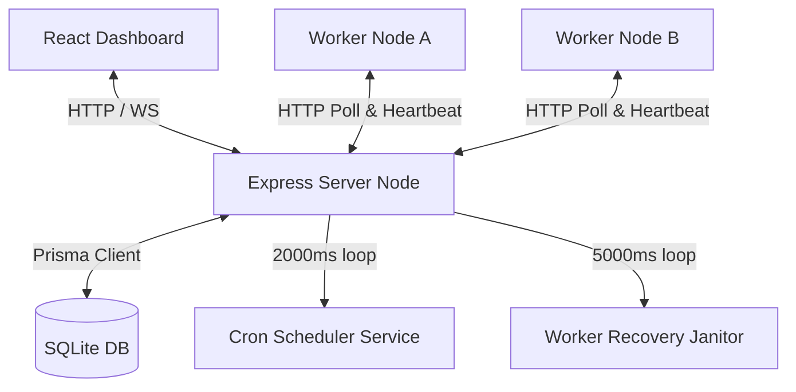
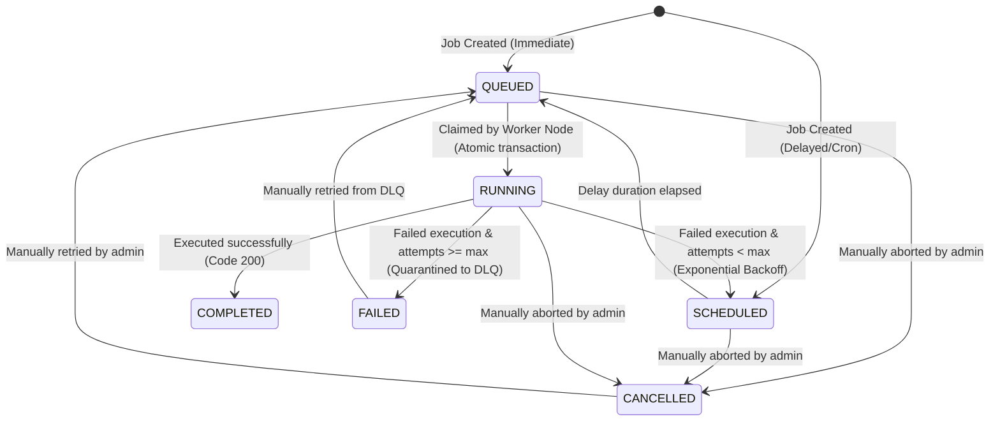

# System Architecture

This document describes the design, components, and execution flows of the **Distributed Job Scheduler** platform.

## System Topology

The platform consists of three decoupled components that communicate over standard network protocols:

### 1. Backend Server (Express + WebSockets)
- Serves as the central coordination hub (Broker).
- Exposes REST APIs for user administration, project management, queue settings, job creation, and worker endpoints.
- Establishes a WebSocket server to push real-time metrics updates to connected dashboards every 2 seconds.
- Coordinates background loops:
  - **Cron Scheduler**: Triggers scheduled cron rules, spawning immediate jobs when they are due.
  - **Worker Recovery Janitor**: Reclaims running jobs from workers that haven't sent a heartbeat for 15+ seconds, applying retry backoff policies.

### 2. Worker Runtimes (Standalone Nodes)
- Lightweight client processes that can be started anywhere and scale horizontally.
- Perform long-polling requests (`POST /api/workers/claim`) to pull jobs.
- Execute jobs concurrently up to a configurable limit (`--concurrency`), using async event loops.
- Capture stdout log sequences and stream them in real-time back to the server (`POST /api/workers/jobs/:id/log`).
- Report system resource utilization (CPU and RAM) to the server every 3 seconds (`POST /api/workers/heartbeat`).
- Gracefully drain active jobs on termination signals (`SIGINT`, `SIGTERM`) before shutting down.

### 3. Dashboard Web Client (React + Vite)
- A single-page application showcasing queue telemetry, worker status, job logs, and throughput charting.
- Subscribes to organization-level live metrics over WebSockets.
- Enables administrative triggers (creating queues, triggering jobs, retrying failures, deactivating crons).

---

## Detailed Job Lifecycle Transitions

The job lifecycle states transition as follows:

---

## Critical Control Loop Flows

### 1. Atomic Job Claiming (No Double-Execution & Rate Limiting)
To prevent multiple workers from claiming the same job, the server runs an interactive database transaction:
1. Fetch all queues in the organization, sorted by priority descending (highest priority first).
2. For each queue, query the count of currently running/claimed jobs. If it equals or exceeds the queue's concurrency limit, skip the queue.
3. If the queue has a sliding window rate limit configured (e.g. max N jobs per S seconds), query the `JobExecution` table to count executions started within the window `[now - S, now]`. If this count exceeds N, skip the queue to prevent API exhaustion.
4. If the queue is eligible, determine the worker's assigned `shardId` via deterministic hashing (`hash(workerId) % queue.shardsCount`). Query the next eligible job (where `scheduledAt <= now` and parent dependencies are met) targeting that specific `shardId`, sorted by job priority descending (highest first) and then by creation date ascending (FIFO). If no job is found and sharding is enabled, fall back to "Work Stealing" by querying other shards in the queue.
5. If found, atomically update its status to `RUNNING`, record the claiming worker's ID, and insert a new `JobExecution` trial.
6. Commit transaction and return job. This prevents lock overlap and ensures single execution.

### 2. Worker Timeout & Recovery (Janitor Loop)
If a worker crashes:
1. The Janitor loops every 5 seconds checking workers where `status = 'ACTIVE'` and `lastHeartbeatAt < (now - 15 seconds)`.
2. Marks the worker as `INACTIVE`.
3. Finds all jobs assigned to that worker in `RUNNING` or `CLAIMED` states.
4. For each job:
   - Increments its retry count.
   - If retry limit exceeded, updates status to `FAILED` and moves it to the Dead Letter Queue.
   - Else, calculates the delay using the queue's backoff strategy, resets the status to `SCHEDULED`, and removes the dead worker association.
