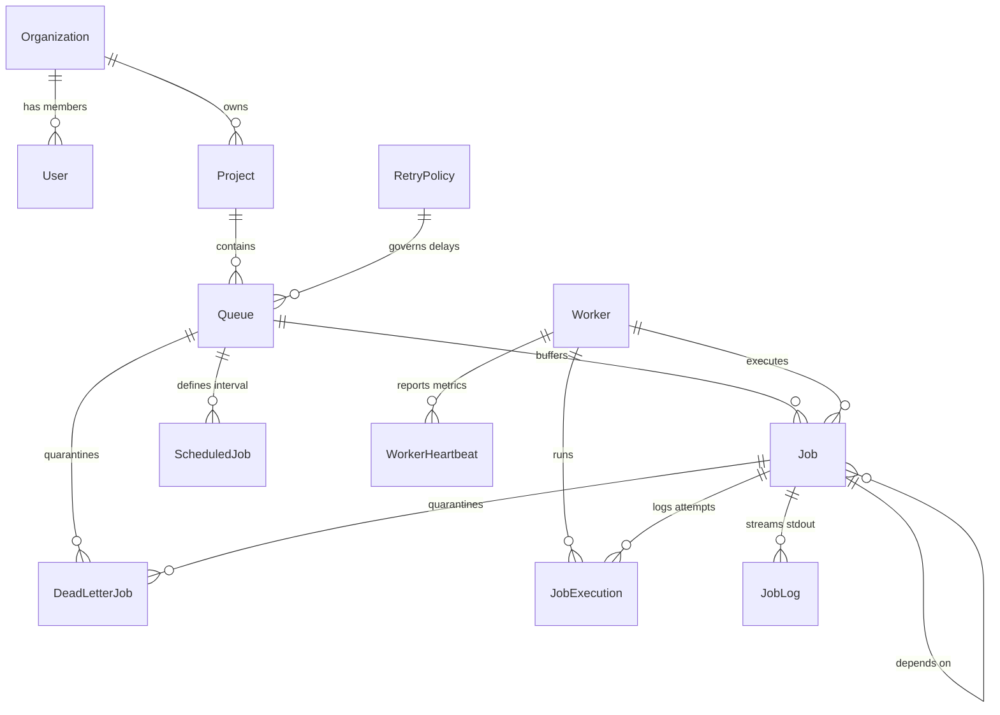

# Database Design

This document details the relational schema, indices, normalization levels, cascading constraints, and performance considerations for the SQLite/Prisma storage layer.

## Entity Relationship (ER) Diagram

The relations are normalized to 3rd Normal Form (3NF) to prevent duplicate data while maintaining referential integrity:

---

## Detailed Model Schema

### 1. Core Tenant Configuration
- **Organization**: The tenant boundary. Projects and Users belong to an Organization.
- **User**: Authentication credentials. Has a password hash and JWT role.
- **Project**: Logical grouping for multiple queues (e.g. "Staging Operations", "Billing Engine").

### 2. Queue Configuration
- **Queue**: Execution pipelines. Properties:
  - `priority` (integer): Higher priorities claimed first.
  - `concurrencyLimit` (integer): Max concurrent jobs executed from this queue.
  - `isPaused` (boolean): Blocks claiming if paused.
  - `rateLimitMax` (integer, nullable): Max executions permitted in sliding window.
  - `rateLimitWindow` (integer, nullable): Sliding window duration in seconds.
  - `shardsCount` (integer): Number of virtual shards for scaling (default 1).
  - `retryPolicyId` (foreign key): Reference to the retry backoff calculator.
- **RetryPolicy**: Configurable delay rules. Supports `strategy` (`FIXED`, `LINEAR`, `EXPONENTIAL`), `baseDelaySecs`, `maxRetries`, and `multiplier`.

### 3. Job Execution & Logs
- **Job**: The main unit of work. Holds the task parameters, priority score (1-10), virtual shard ID (`shardId`), scheduled execution time, retry attempt counter, status, and dependency reference (`parentJobId`).
- **JobExecution**: Stores each execution trial (worker assigned, start/finish times, duration, success/failure status, and exception error messages).
- **JobLog**: Real-time stdout console logs streamed by workers during run.
- **ScheduledJob**: Stores recurring patterns (cron strings) and parameters. Evaluated by the scheduler to spawn standard jobs.
- **DeadLetterJob**: Quarantined container holding jobs that exceeded max retries, tracking their payload, queue, failure reason, and timestamp.

---

## Normalization & Integrity

1. **Third Normal Form (3NF)**:
   - All fields depend directly on their primary key.
   - User credentials belong to the Organization and are separated from Projects.
   - Retry delays are isolated into `RetryPolicy` so multiple queues can share a single policy.
   - Real-time worker performance telemetry goes into `WorkerHeartbeat` rather than polluting the `Worker` status table.
2. **Cascading Behavior**:
   - **Cascade Deletes**: Deleting an `Organization` automatically cleans up all associated `User`, `Project`, `Queue`, `Job`, `JobExecution`, `JobLog`, and `ScheduledJob` records. This ensures clean workspace deletion.
   - **Nullification (SetNull)**: Deleting a `Worker` sets the `workerId` on `Job` and `JobExecution` to `null`. This prevents orphan foreign key errors while preserving the historical logs of which job executions occurred in the past.
   - **SetNull on Policy**: Deleting a `RetryPolicy` resets the queue's policy reference to `null`, reverting to default retry behaviors.

---

## Performance & Indexing Strategy

To handle high-frequency reads and writes without concurrency locks:

1. **SQLite Write-Ahead Logging (WAL)**:
   - Enabled automatically by Prisma.
   - WAL mode allows concurrent readers to query database tables while a writer is modifying records, drastically reducing connection timeouts.
2. **Database Indices**:
   - `Job(status, scheduledAt)`: Crucial for claiming. The claiming query filters jobs that are `QUEUED`/`SCHEDULED` and due (`scheduledAt <= now`). This index speeds up lookup from $O(N)$ linear scans to $O(\log N)$ binary scans.
   - `Job(queueId)`: Optimizes queue status aggregations and metrics queries.
   - `Worker(lastHeartbeatAt, status)`: Speeds up the recovery loop which queries active workers that haven't sent heartbeats in 15 seconds.
   - `JobLog(jobId)`: Accelerates real-time log loading on the dashboard.
